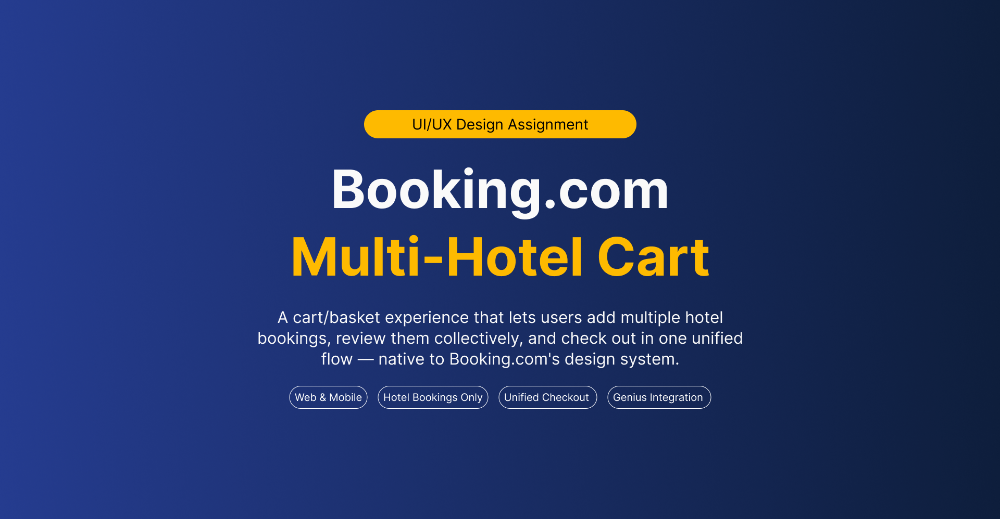
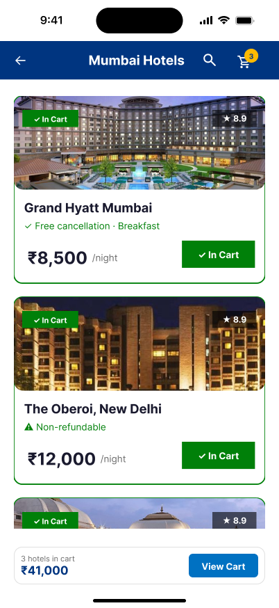
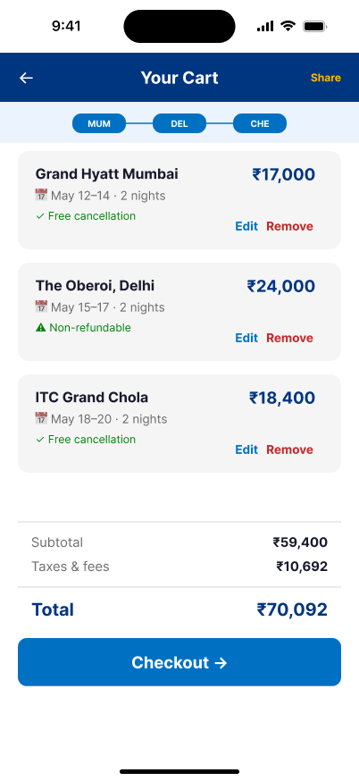
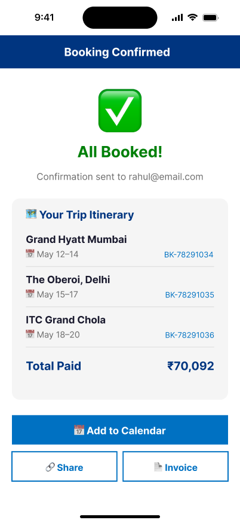

# Booking.com Multi-Hotel Cart UX Case Study

A UX/product design case study exploring a unified multi-hotel booking experience for multi-city travelers, comparison shoppers, business travelers, and group trip organizers.

This project redesigns the traditional hotel booking flow by introducing a scalable multi-hotel cart system with unified checkout, comparison support, and streamlined trip management.

---

## 🔗 Live Demo

👉 [View Interactive Prototype](https://gautamc01.github.io/Booking-multi-hotel-cart-case-study/)

---
## Figma Prototype

👉 [Explore Full Figma Prototype](https://www.figma.com/proto/31SQjY4g34zeOk25QHhz74/Booking.com?node-id=0-1&t=SaU69pwH28nZYhlX-1)

---
## 📄 UX Case Study PDF

👉 [Download Full Case Study PDF](./booking-case-study.pdf.pdf)

---

# Overview

Most hotel booking platforms still force users to complete reservations one hotel at a time.

For travelers planning:
- multi-city trips,
- group travel,
- business stays,
- or hotel comparisons,

this creates unnecessary friction and repetitive checkout behavior.

This concept redesign explores how Booking.com could introduce a unified multi-hotel cart experience while maintaining a clean and scalable booking flow.

---

# Problem Statement

Users currently face several challenges during multi-hotel booking experiences:

- No unified cart or basket system
- Repetitive checkout process for each hotel
- Difficulty comparing multiple hotels before booking
- Lack of trip-level pricing visibility
- Risk of losing hotel availability during separate bookings

These issues increase cognitive load, booking friction, and potential session drop-offs.

---

# Proposed Solution

Designed a unified multi-hotel cart and checkout experience inspired by modern e-commerce systems while preserving Booking.com's existing interaction patterns.

The solution introduces:

- Multi-hotel booking cart
- Unified checkout experience
- Persistent cart access
- Hotel comparison workflow
- Shared guest-detail handling
- Responsive mobile interactions
- Transparent cancellation and pricing communication
- Smart edge-case management

---

# UX Strategy & Design Thinking

## 1. Frictionless Add-to-Cart Flow

Users can add hotels directly from search results without interrupting browsing behavior.

---

## 2. Unified Checkout System

A single checkout flow reduces repetitive data entry and simplifies multi-stay booking experiences.

---

## 3. Trip-Centric Experience

The interface frames bookings as one connected journey instead of isolated hotel reservations.

---

## 4. Trust Through Transparency

Cancellation rules, price changes, and availability states are surfaced early to reduce uncertainty.

---

## 5. Comparison-Driven Decision Making

Users can shortlist and compare multiple hotels before committing to final bookings.

---

# Edge Cases Considered

- Hotel becomes unavailable during checkout
- Price changes after cart addition
- Mixed cancellation policies
- Different guest assignments per hotel
- Cart size limitations
- Session persistence handling

---

# Mobile Experience

The mobile experience preserves the same unified booking flow while adapting interactions for smaller screens and touch-first usability.

---

### Mobile Search Experience

---

### Mobile Cart Experience

---

### Mobile Confirmation Experience

---

# Key Screens Designed

- Search Results Experience
- Add-to-Cart Interaction
- Cart Drawer
- Unified Cart Review
- Checkout Flow
- Payment Experience
- Booking Confirmation
- Mobile Responsive Screens

---

## Booking Confirmation Experience

Users receive a unified booking confirmation experience for all selected stays, improving trip clarity and booking confidence.

---

# Tools Used

- Figma
- HTML
- CSS
- JavaScript
- GitHub Pages

---

# Outcome

This project demonstrates how thoughtful UX strategy and systems thinking can improve complex travel booking experiences while balancing usability, scalability, and business goals.

---

# Author

## Gautam Chopada  
UI/UX Designer

📧 choprag001@gmail.com
